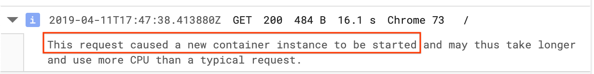

# [Google Cloud Run][run] - FAQ

> ⚠️ This repository is a **community-maintained** knowledge base. It does not
> reflect Google’s product roadmap. Refer to the [**Cloud Run
> documentation**][docs] for the most up-to-date information, as this page may
> go out of date.

- **Is this repo useful?** Please **⭑Star** this repository and share the love.
- **Curious about something?** Open an [issue](/issues), someone may be able to
  add it to the FAQ.
- **Contribute** if you learned something interesting about Cloud Run.
- **Trouble using Cloud Run?** Ask a question [on Stack  Overflow][so].
- **Check out** [awesome-cloudrun][awesome] for a curated list of Cloud Run
  articles, tools and examples.

[run]: https://cloud.google.com/run/
[docs]: https://cloud.google.com/run/docs
[so]: https://stackoverflow.com/questions/ask?tags=google-cloud-run
[awesome]: https://github.com/steren/awesome-cloudrun

-----

<!--
TODO(ahmetb): All the markdown ToC extensions for vscode I tried deeply suck.
They are either superbuggy/unmaintained, or can't generate href targets
compatible with Github Flavored Markdown.
-->

<!--
  ⚠️ DO NOT UPDATE THE TABLE OF CONTENTS MANUALLY ️️⚠️
  - install markdown-toc tool: npm install -g markdown-toc
  - run: markdown-toc -i README.md
-->

<!-- toc -->

- [Basics](#basics)
  * [What is Cloud Run?](#what-is-cloud-run)
  * [How is it different than App Engine Flexible?](#how-is-it-different-than-app-engine-flexible)
  * [How is it different than Google Cloud Functions?](#how-is-it-different-than-google-cloud-functions)
  * [How does it compare to AWS Fargate?](#how-does-it-compare-to-aws-fargate)
  * [How does it compare to Azure Container Instances?](#how-does-it-compare-to-azure-container-instances)
  * [What is “Cloud Run on GKE”?](#what-is-cloud-run-on-gke)
  * [Is Cloud Run hosted Knative?](#is-cloud-run-hosted-knative)
- [Developing Applications](#developing-applications)
  * [Which applications are suitable for Cloud Run?](#which-applications-are-suitable-for-cloud-run)
  * [What if my application is doing background tasks?](#what-if-my-application-is-doing-background-tasks)
  * [Which languages can I run on Cloud Run?](#which-languages-can-i-run-on-cloud-run)
  * [Can I run my own system libraries and tools?](#can-i-run-my-own-system-libraries-and-tools)
  * [Where do I get started to deploy a HTTP web server container?](#where-do-i-get-started-to-deploy-a-http-web-server-container)
  * [How do I make my web application compatible with Cloud Run?](#how-do-i-make-my-web-application-compatible-with-cloud-run)
- [Deploying](#deploying)
  * [How do I continuously deploy to Cloud Run?](#how-do-i-continuously-deploy-to-cloud-run)
  * [Which container registries can I deploy from?](#which-container-registries-can-i-deploy-from)
  * [How can I deploy from other GCR registries?](#how-can-i-deploy-from-other-gcr-registries)
  * [How can I serve traffic multiple revisions?](#how-can-i-serve-traffic-multiple-revisions)
  * [Can I use `kubectl` to deploy to Cloud Run?](#can-i-use-kubectl-to-deploy-to-cloud-run)
- [Cold Starts](#cold-starts)
  * [Does Cloud Run have cold starts?](#does-cloud-run-have-cold-starts)
  * [When will my service scale to zero?](#when-will-my-service-scale-to-zero)
  * [How do I minimize the cold start latencies?](#how-do-i-minimize-the-cold-start-latencies)
  * [How can I tell if a request was a “cold start”?](#how-can-i-tell-if-a-request-was-a-cold-start)
- [Serving Traffic](#serving-traffic)
  * [What's the maximum request execution time limit?](#whats-the-maximum-request-execution-time-limit)
  * [Does my service get a domain name on Cloud Run?](#does-my-service-get-a-domain-name-on-cloud-run)
  * [Are all Cloud Run services publicly accessible?](#are-all-cloud-run-services-publicly-accessible)
  * [How much additional latency does running on Cloud Run add?](#how-much-additional-latency-does-running-on-cloud-run-add)
  * [Does my application get multiple requests concurrently?](#does-my-application-get-multiple-requests-concurrently)
  * [What if my application can’t handle concurrent requests?](#what-if-my-application-cant-handle-concurrent-requests)
  * [How do I find the right concurrency level for my application?](#how-do-i-find-the-right-concurrency-level-for-my-application)
- [Autoscaling](#autoscaling)
  * [Does my Cloud Run service scale to zero?](#does-my-cloud-run-service-scale-to-zero)
  * [How can I limit the total number of instances for my application?](#how-can-i-limit-the-total-number-of-instances-for-my-application)
  * [What’s the upper scaling limit for Cloud Run?](#whats-the-upper-scaling-limit-for-cloud-run)
- [Runtime](#runtime)
  * [Which operating system Cloud Run applications run on?](#which-operating-system-cloud-run-applications-run-on)
  * [Can I use the local filesystem?](#can-i-use-the-local-filesystem)
  * [Which system calls are supported?](#which-system-calls-are-supported)
  * [Which executable ABIs are supported?](#which-executable-abis-are-supported)
  * [What happens if my container exits/crashes?](#what-happens-if-my-container-exitscrashes)
  * [What is the termination signal for Cloud Run services?](#what-is-the-termination-signal-for-cloud-run-services)
  * [Where can I find the "instance ID" of my container?](#where-can-i-find-the-instance-id-of-my-container)
  * [How can my service can tell it is running on Cloud Run?](#how-can-my-service-can-tell-it-is-running-on-cloud-run)
- [Monitoring and Logging](#monitoring-and-logging)
  * [Where do I write my application logs?](#where-do-i-write-my-application-logs)
  * [How can I have structured logs?](#how-can-i-have-structured-logs)
  * [Is Cloud Run integrated with Stackdriver APM?](#is-cloud-run-integrated-with-stackdriver-apm)
  * [How can I do Tracing on Cloud Run?](#how-can-i-do-tracing-on-cloud-run)
- [Pricing](#pricing)
  * [Is there a “Free Tier”?](#is-there-a-free-tier)
  * [When am I charged?](#when-am-i-charged)
  * [How is billed time calculated?](#how-is-billed-time-calculated)
  * [What do I pay for on Cloud Run?](#what-do-i-pay-for-on-cloud-run)

<!-- tocstop -->

-----

## Basics

### What is Cloud Run?

[Cloud Run][run] is a service by Google Cloud Platform to run your stateless
HTTP containers without worrying about provisioning machines, clusters or
autoscaling.

With Cloud Run, you go from a "container image" to a fully managed web
application running on a domain name with TLS certificate that auto-scales with
requests in a single command. You only [pay](#pricing) while a request is
handled.

### How is it different than App Engine Flexible?

[GAE Flexible](https://cloud.google.com/appengine/docs/flexible/) and [Cloud
Run][run] are very similar. They both execute your application code in
containers, they both auto-scale, and manage the infrastructure your code runs
on for you. However:

* GAE Flexible is built on VMs, therefore is slower to deploy and scale.
* GAE Flexible does not scale to zero, at least 1 instance must be running.
* GAE Flexible billing has 1 minute granularity, Cloud Run in 0.1 second.

### How is it different than Google Cloud Functions?

[GCF](https://cloud.google.com/functions) lets you deploy snippets of code
(functions) written in a limited set of programming languages, to natively
handle HTTP requests or events (Pub/Sub).

Cloud Run only handles HTTP requests. However, it can respond to events that are
delivered with [Pub/Sub HTTPS push](https://cloud.google.com/pubsub/docs/push).
(See [this tutorial](https://cloud.google.com/run/docs/tutorials/pubsub)).

Cloud Run lets you deploy using any programming language, since it accepts
container images (more flexible, but also potentially more tedious to develop).
It also allows using any tool or system library from your application (see
[here](#can-i-run-my-own-system-libraries-and-tools)) and GCF doesn’t let you
use such custom system executables.

Both services auto-scale your code, manage the infrastructure your code runs on
and they both run on Google’s serverless infrastructure.

### How does it compare to AWS Fargate?

[AWS Fargate](https://aws.amazon.com/fargate/) and Cloud Run both let you run
containers without managing the underlying infrastructure (VMs, clusters).

Cloud Run supports running only HTTP servers, and therefore can do request-aware
autoscaling, as well as scale-to-zero. Fargate autoscaling is CPU/memory based
and is more suitable for containers that can be long-running (batch, background
etc).

Therefore, the pricing model is different. On Cloud Run, you only pay while a
request is being handled.

### How does it compare to Azure Container Instances?

[Azure Container
Instances](https://azure.microsoft.com/en-us/services/container-instances/) and
Cloud Run both let you run containers without managing the underlying
infrastructure (VMs, clusters). Both ACI and Cloud Run give you a publicly
accessible endpoint after deploying the application.

Cloud Run supports running only HTTP servers and offers auto-scaling, and scale
to zero. ACI is
for long-running containers. Therefore, the pricing model is different. On Cloud
Run, you only pay while a request is being handled.

### What is “Cloud Run on GKE”?

"Cloud Run on GKE" gives you the same Cloud Run experience on your
[Kubernetes](https://kubernetes.io) clusters running on
[GKE](https://cloud.google.com/kubernetes-engine/). This gives you the freedom
to choose where you want to deploy your applications.

Both Cloud Run and "Cloud Run on GKE" have:

* the same application format (container images)
* the same deployment/management experience (`gcloud` or Cloud Console)
* the same API ([Knative serving API][knative]).

Look at [this diagram](https://twitter.com/ahmetb/status/1116041166359654400),
or [**watch this video**](https://www.youtube.com/watch?v=RVdhyprptTQ) to decide
how to choose between the two.

Cloud Run on GKE basically installs and manages a Knative installation (with
some additional GCP-specific components for monitoring etc) on your Kubernetes
cluster so that you don’t have to worry about installing and managing Knative
yourself.

[knative]: https://www.knative.dev/

### Is Cloud Run hosted Knative?

Sort of.

Cloud Run implements most parts of the [Knative Serving
API](https://www.knative.dev/docs/reference/serving-api/). However, the
underlying implementation of the functionality could differ from the open source
[Knative][knative] implementation.

With [Cloud Run on GKE](#what-is-cloud-run-on-gke), you actually get a Knative
installation.

## Developing Applications

### Which applications are suitable for Cloud Run?

[Cloud Run][run] is designed to run **stateless** HTTP web application
containers. Other kinds of applications may not be fit for Cloud Run.

If your application is doing **background processing** while it’s not handling
requests or storing in-memory state, it may not be suitable.

### What if my application is doing background tasks?

Your application’s CPU allowance is **significantly throttled** nearly down to
zero while it's not handling a request.
<sup>[[source](https://youtu.be/xVuuvZkYiNM?t=552)]</sup>

Therefore, your application should limit CPU usage outside request processing to
a minimum. It might not be entirely possible since the programming language you
use might do _garbage collection_ or similar runtime tasks in the background.

### Which languages can I run on Cloud Run?

If an application can be packaged into a container image that can run on Linux
(x86-64), it can be executed on Cloud Run.

Web applications written in languages like Node.js, Python, Go, Java, Ruby, PHP,
Rust, Kotlin, Swift, C/C++ can work on Cloud Run. _(.NET Core is currently
not supported due to a bug.)_

🍄 Users managed to run web servers written in x86 assembly, or [22-year old
Python
1.3](https://dev.to/di/ministry-of-silly-runtimes-vintage-python-on-cloud-run-3b9d)
on Cloud Run.

### Can I run my own system libraries and tools?

Yes, see the section above. Since Cloud Run accepts container images as the
deployment unit, you can add arbitrary executables (like `grep`, `ffmpeg`,
`imagemagick`) or system libraries (`.so`, `.dll`) to your container image and
use them in your application.

See [this tutorial](https://cloud.google.com/run/docs/tutorials/system-packages)
using Graphviz `dot` that generates PNG diagrams.

### Where do I get started to deploy a HTTP web server container?

See [Cloud Run
Quickstart](https://cloud.google.com/run/docs/quickstarts/build-and-deploy)
which has sample applications written in many languages.

### How do I make my web application compatible with Cloud Run?

Your existing applications must listen on `PORT` environment variable to work
on Cloud Run (see [container contract][container-contract]). (This value is
currently only `8080`, but it may change in the future.)

If your existing application doesn't allow you to configure port number it
listens on, Cloud Run currently doesn't allow customizing the `PORT` value.

## Deploying

### How do I continuously deploy to Cloud Run?

Follow [this tutorial](https://cloud.google.com/run/docs/continuous-deployment)
to learn how you can deploy on a new git commit using [Google Cloud Build][gcb].

(If you know of articles about other CI/CD system integrations, add them here.)

For other external CI/CD systems, roughly the steps you should follow:

1. Create a new service account with a JSON key.
1. Give the service account IAM permissions to deploy to Cloud Run.
1. Upload the JSON key to the CI/CD environment, and authenticate to `gcloud`
   by calling:

       gcloud auth activate-service-account --key-file=[KEY_JSON_FILE]

1. Deploy the app by calling:

       gcloud beta run deploy [MY_SERVICE] --image=[...] [...]

[gcb]: https://cloud.google.com/cloud-build/

### Which container registries can I deploy from?

Cloud Run currently only allows deploying images hosted on Google Container
Registry (`*.gcr.io/*`).

### How can I deploy from other GCR registries?

If you're deploying from GCR registries on another GCP project:

- public registries: should be deploying without additional configuration
- private registries: need to give GCR access to service account used by Cloud
  Run.

To give access, go to [IAM&Admin](https://console.google.com/iam-admin/iam) on
Cloud Console, and find the email for "Google Cloud Run Service Agent". Then
follow [this
document](https://cloud.google.com/container-registry/docs/access-control#granting_users_and_other_projects_access_to_a_registry)
to give this service account GCR access on the other project.

### How can I serve traffic multiple revisions?

If you updated your Cloud Run service, you probably realized it creates a new
[revision](https://cloud.google.com/run/docs/managing/revisions) for every new
configuration of your service.

However, Cloud Run (currently) only supports serving traffic from the last
healthy revision of your service. Therefore, it currently does not support
_revision based traffic splitting_ and _canary deployments_.

### Can I use `kubectl` to deploy to Cloud Run?

Since Cloud Run supports the [Knative][knative] serving API (currently)
partially, you could in theory craft a [kubeconfig] file that targets the Cloud
Run API endpoint to deploy a [Knative Service][ksvc] resource.

Many fields of the container specification exposed in Knative API, some
annotations, and operations like patching (`kubectl apply`) are not supported.

[kubeconfig]: https://kubernetes.io/docs/concepts/configuration/organize-cluster-access-kubeconfig/
[ksvc]: https://www.knative.dev/docs/reference/serving-api/#Service

## Cold Starts

### Does Cloud Run have cold starts?

Yes. If a Cloud Run service does not receive requests for a long time, it will
take some time to start it again. This will add additional delay to the first
request.

Cold start latency depends on [many
factors](https://cloud.google.com/run/docs/tips#optimizing_performance), however
many users observe additional **~2 seconds** latency on cold starts.
<sup>[more user data needed!]</sup>

### When will my service scale to zero?

Cloud Run does not provide any guarantees on how long it will keep a service
"warm". It depends on factors like capacity and Google’s implementation
details.

Some users see their services staying warm up to an hour, or longer.
<sup>[more user data needed!]</sup>

### How do I minimize the cold start latencies?

See [performance optimization
tips](https://cloud.google.com/run/docs/tips#starting_services_quickly),
basically:

- keep your container image size small
- keep your app’s "time to listen for requests" startup time short
- prevent your application process from crashing

### How can I tell if a request was a “cold start”?

Each request to Cloud Run services is logged to Stackdriver logging, with an
indicator whether instance was "warm" or "cold" during that request (see
[Viewing Logs][logging]).

[logging]: https://cloud.google.com/run/docs/logging

If you view logs from Cloud Run console, these requests are marked:



## Serving Traffic

### What's the maximum request execution time limit?

Currently, a request times out after **15 minutes**. See [limits][lim].

### Does my service get a domain name on Cloud Run?

Yes, every Cloud Run service gets a `*.run.app` domain name for free. You can
also use [your domain names][custom-domains].

[custom-domains]: https://cloud.google.com/run/docs/mapping-custom-domains

### Are all Cloud Run services publicly accessible?

No. Cloud Run allows services to be either **publicly accessible** to anyone on
the Internet, or **private services** that require [authentication]

[authentication]: https://cloud.google.com/run/docs/securing/authenticating.

### How much additional latency does running on Cloud Run add?

> TODO(ahmetb): Write this section. Ideally we should link to some blog posts
> doing an analysis of this.

### Does my application get multiple requests concurrently?

Contrary to most serverless products, Cloud Run is able to send multiple
requests to be handled
[simultaneously](https://cloud.google.com/run/docs/about-concurrency) to
your container instances.

Each container instance on Cloud Run is (currently) allowed to handle [up to
80][lim] concurrent requests. This is also the default value.

### What if my application can’t handle concurrent requests?

If your application cannot handle this number, you
can configure this number while deploying your service in `gcloud` or Cloud
Console.

Most of the popular programming languages can process multiple requests at the
same time thanks to multi-threading. But some languages may need additional
components to do concurrent requests (e.g. PHP with
[Apache](https://hub.docker.com/_/php), or Python with
[gunicorn](https://github.com/knative/docs/blob/7c4ff1c98e072b3c61649f35e6cafb11b00c6ab0/docs/serving/samples/hello-world/helloworld-python/Dockerfile#L11)).

[lim]: https://cloud.google.com/run/quotas

### How do I find the right concurrency level for my application?

Each application and language can process different levels of simultaneously
without having them time out. That's why Cloud Run allows you to
[configure](https://cloud.google.com/run/docs/about-concurrency) concurrency
per service.

You should do "load testing" to find out where your application should stop
handling additional request and additional instances should be created. Read
[Tuning concurrency](https://cloud.google.com/run/docs/tips#using_concurrency)
for more.

## Autoscaling

### Does my Cloud Run service scale to zero?

Yes, although you can’t really see how many container instances are running your
service. When your service is not receiving requests, you are not paying for anything.

Therefore, after not receiving any requests for a while, the first request may
observe [cold start](#cold-starts) latency.

### How can I limit the total number of instances for my application?

You currently can’t.

Cloud Run currently does not provide an option to limit the count of container
instances your application runs on.

### What’s the upper scaling limit for Cloud Run?

Each Cloud Run service can scale [up to 1000 container instances][lim] during
the **beta** period. Each container instance can handle [up to 80 simultaneous
requests][lim].

## Runtime

### Which operating system Cloud Run applications run on?

Linux.

However, since you bring your own container image, you get to decide
your system libraries like libs (e.g. musl libc in alpine, or glibc in debian
based images).

Your applications run on [gVisor](https://gvisor.dev/docs/) which only supports
Linux (currently).

### Can I use the local filesystem?

Yes, **however** files written to the local filesystem **count towards available
memory** and may cause container instance to go out-of-memory and crash.

Therefore, writing files to local filesystem are discouraged, with the exception
of [`/var/log/*` path for logging](https://cloud.google.com/run/docs/logging).

### Which system calls are supported?

Cloud Run applications run on [gVisor](https://gvisor.dev) container sandbox,
which executes Linux kernel system calls made by your application in userspace.

gVisor does not implement all system calls (see
[here](https://gvisor.dev/docs/user_guide/compatibility/amd64/)). If your app
has such a system call (**quite rare**), it will not work on Cloud Run. Such an
event [is logged](https://cloud.google.com/run/docs/troubleshooting#sandbox) and
you can [use
`strace`](https://cloud.google.com/run/docs/troubleshooting/tracing-system-calls)
to determine when the system call was made in your app.

### Which executable ABIs are supported?

Applications compiled for Linux in 32-bit or 64-bit are supported. To be
precise, ELF executables compiled to
[x84-64](https://en.wikipedia.org/wiki/X86-64). See [Container
Contract][container-contract].

[container-contract]: https://cloud.google.com/run/docs/reference/container-contract

### What happens if my container exits/crashes?

If the entrypoint process of a container exits, the container is stopped. A
crashed container triggers [cold start](#cold-starts) while the container is
restarted. Avoid exiting/crashing your server process by handling exceptions.

### What is the termination signal for Cloud Run services?

Currently, Cloud Run terminates containers while [scaling to
zero](#does-my-cloud-run-service-scale-to-zero) with unix signal 9 (`SIGKILL`).
`SIGKILL` is not trappable (capturable) by applications. Therefore, your
applications should be okay to be killed abruptly.

### Where can I find the "instance ID" of my container?

The [logs][logging] collected from a container instance specify the unique
instance ID of the container when the logs are viewed on Stackdriver Logging.
This instance ID is not made available to the application.

To identify your container instance while it’s running, generate a random UUID
during the startup of your process and store it in a variable.

### How can my service can tell it is running on Cloud Run?

Cloud Run provides some [environment variables][container-contract] standard in
[Knative][knative]. Ideally you should explicitly deploy your app with an
environment variable indicating it is running on Cloud Run.

You can also access [instance
metadata](https://cloud.google.com/appengine/docs/standard/java/accessing-instance-metadata)
endpoints like
`http://metadata.google.internal/computeMetadata/v1/project/project-id` to
determine if you are on Cloud Run. However, this will not distinguish "Cloud
Run" vs "Cloud Run on GKE" as the metadata service is available on GKE nodes as
well.

## Monitoring and Logging

### Where do I write my application logs?

Anything your application writes to standard output (stdout) or standard error
(stderr) is collected as logs by Cloud Run.

Some existing apps might not be complying with that (e.g. nginx writes logs to
`/var/log/nginx/error.log`). Therefore any files written under `/var/log/*` are
also aggregated. [Learn more here][logging].

### How can I have structured logs?

All your log lines must be JSON objects with fields [recognized by Stackdriver
Logging](https://cloud.google.com/logging/docs/agent/configuration#special-fields),
such as `timestamp`, `severity`, `message`.

### Is Cloud Run integrated with Stackdriver APM?

Yes. See [this document](https://cloud.google.com/run/docs/monitoring) on how to
view various metrics about your Cloud Run container instances.

### How can I do Tracing on Cloud Run?

TODO(ahmetb): Write this section.

## Pricing

> [Cloud Run Pricing documentation][pricing] has the most up-to-date information.

[pricing]: https://cloud.google.com/run/pricing

### Is there a “Free Tier”?

Yes! See [Pricing documentation][pricing].

### When am I charged?

You only pay **while a request is being handled** on your container instance.

This means an application that is not getting traffic is **free of charge**.

### How is billed time calculated?

Based on "time serving requests" on each instance. If your service handles
multiple requests simultaneously, you do not pay for them separately. (This is a
**cost saver!**)

Each billable timeslice is **rounded up** to the nearest **100
milliseconds**.

Read how the [billable
time](https://cloud.google.com/run/pricing#billable_time) is calculated, it is
basically like this:

```
          request1            response1
                |   request2     ʌ      response2
                |        |       |       ʌ
                v........|......./       |
                         |               |
                         v.............../

|-----FREE-----|----------BILLED----------|----FREE...
```

### What do I pay for on Cloud Run?

You are paying for CPU, memory and the traffic sent to the client from your
application (egress traffic).

-----

This is not an official Google project or roadmap. Refer to the [Cloud Run
documentation][docs] for the authoritative information. This project is
[licensed](./LICENSE) under Creative common Attribution 4.0 International (CC BY
4.0) license.

> **Your question not answered here?** Open an [issue](/issues) and see if we can
answer.
